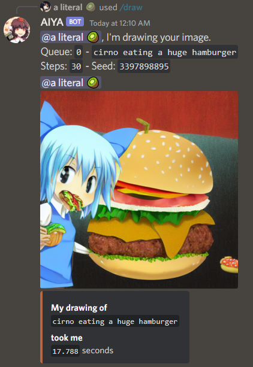

# AIYA
A Discord bot interface for Stable Diffusion

### Usage
To generate an image from text, use the /draw command and include your prompt as the query.

##### Currently supported options
- negative prompts
- sampling steps
- height/width (up to 768)
- config/guidance scale
- seed

### Setup requirements
- Set up [AUTOMATIC1111's Stable Diffusion AI Web UI](https://github.com/AUTOMATIC1111/stable-diffusion-webui).
- Run the Web UI as local host (`COMMANDLINE_ARGS= --listen`).
- Clone this repo, then install dependencies in `requirements.txt` in your Python environment.
- Invite Discord bot with `bot` and `application.commands` scope. Make sure intents are enabled.
- Create a text file in your cloned repo called ".env", containing `TOKEN = [your bot token]`
- Run the bot by typing "python bot.py" in the repository directory

This bot is heavily based on:
https://github.com/harubaru/discord-stable-diffusion
with interfacing from:
https://github.com/gingivere0/dalebot
